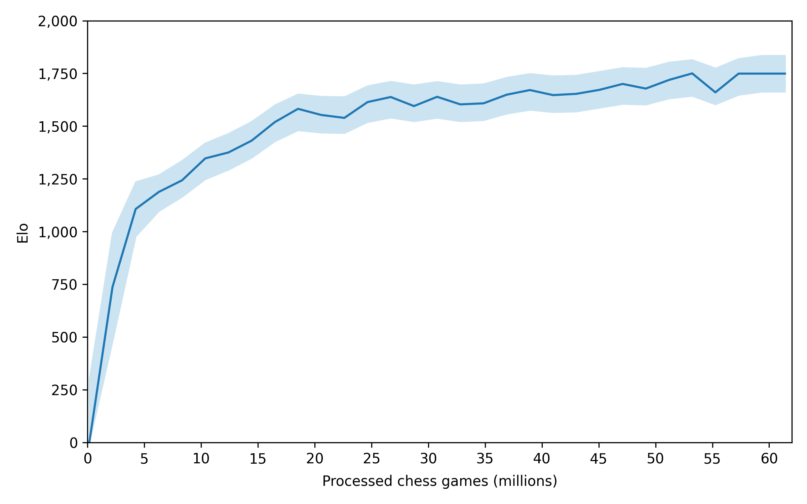
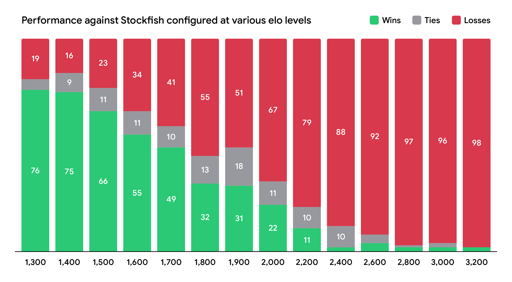

# ♟️ Chess AI


<br/>

This repository contains the code to train and test an autoregressive transformer model on chess games from scratch. I also used it to train the  open-source [**DimChess-0.3B**](#-dimchess-03b) model.

<br/>

<p align="center">
	
</p>

<br/>

# 📋 Summary

* **[📋 Summary](#-summary)**
* **[🤖 DimChess-0.3B](#-dimchess-03b)**
	* [🏗️ Architecture](#%EF%B8%8F-architecture)
	* [💾 Data](#-data)
	* [🦾 Training](#-training)
	* [🧪 Tests](#-tests)
	* [🎛️ Weights](#%EF%B8%8F-weights)
* **[📦 Dependencies](#-dependencies)**
* **[🦾 Training](#-training-1)**
* **[⚗️ Testing](#%EF%B8%8F-testing)**
* **[🙏 Credits](#-credits)**

<br/>

# 🤖 DimChess-0.3B

Using this repository, I trained [**DimChess-0.3B**](https://drive.google.com/drive/folders/1XxKdsR33rt6VTFAF8qwyE3uxulK7gK6m), a small 0.3B chess model on 14M chess games with my personal RTX 3090 GPU during ≈260 hours.

<br/>

## 🏗️ Architecture

The model is based on the transformer architecture (only the decoder part) from the paper [**Attention is All You Need**](https://doi.org/10.48550/arXiv.1706.03762) by **Google Brain** (2017), with a few improvements:

* I replaced the default normalization layer by the Root Mean Square Layer Normalization (RMSNorm) from the paper [**Root Mean Square Layer Normalization**](https://doi.org/10.48550/arXiv.1910.07467) by **Edinburgh University** (2019)

* I moved the normalization layers before the transformer blocks (instead of after) like in the paper [**On Layer Normalization in the Transformer Architecture**](https://doi.org/10.48550/arXiv.2002.04745) by **Microsoft Research** (2020)

* I replaced the ReLU activation by the SwiGLU activation from the paper [**GLU Variants Improve Transformer**](https://doi.org/10.48550/arXiv.2002.05202) by **Google** (2020)

* I implemented Grouped-Query Attention (GQA) from the paper [**GQA: Training Generalized Multi-Query Transformer Models from Multi-Head Checkpoints**](https://doi.org/10.48550/arXiv.2305.13245) by **Google Research** (2023)

* I replaced the absolute positional embedding by the Rotary Position Embedding (RoPE) from the paper [**RoFormer: Enhanced Transformer with Rotary Position Embedding**](https://doi.org/10.48550/arXiv.2104.09864) by **Zhuiyi Technology** (2023)

* I added mulitple input and output embeddings to use different token vocabularies at the same time (board position, piece type, capture...)

<br/>

Here are the main parameters of the architecture:

<table>
	<thead>
		<tr>
			<th align="center">Parameter</th>
			<th align="center">Value</th>
		</tr>
	</thead>
	<tbody>
		<tr>
			<td align="left">Embedding dimension</td>
			<td align="center">1,024</td>
		</tr>
		<tr>
			<td align="left">Number of layers</td>
			<td align="center">24</td>
		</tr>
		<tr>
			<td align="left">Heads dimension</td>
			<td align="center">64</td>
		</tr>
		<tr>
			<td align="left">Feed forward hidden dimension</td>
			<td align="center">2,730</td>
		</tr>
		<tr>
			<td align="left">Number of heads</td>
			<td align="center">16</td>
		</tr>
		<tr>
			<td align="left">Number of grouped heads</td>
			<td align="center">4</td>
		</tr>
		<tr>
			<td align="left">Context length</td>
			<td align="center">2048</td>
		</tr>
		<tr>
			<td align="left">Vocab sizes</td>
			<td align="center">74, 13, 2, 2, 2, 2</td>
		</tr>
	</tbody>
</table>

<br/>

The resulting model has 264,436,736 trainable parameters and fits on a single RTX 3090 GPU with a batch size of 4 for training using mixed precision. For inference only, the model will probably fit on any modern GPU.

<br/>

## 💾 Data

The dataset I made to train this model is composed of 14M chess games from high level players for a total of 1.2B moves played between 1600 and 2024. You can download it on [**Hugging Face 🤗**](https://huggingface.co/datasets/angeluriot/chess_games).

For the tokenization, I created a custom multi layer move to token tokenizer with 6 different vocabularies:
1. **Board position** : 74 tokens for the 64 squares of the chess board + 10 control tokens
2. **Piece type** : 13 tokens for the 12 different pieces + 1 null token
3. **Capture** : 2 tokens for the capture state
4. **En passant** : 2 tokens for the en passant state
5. **Check** : 2 tokens for the check state
6. **Checkmate** : 2 tokens for the checkmate state

A move is usually composed of 3 tokens (each token containing 6 layers):
1. The board position of the piece to move with the piece type (`null` for the other layers)
2. The board position of the destination square with the piece type (can be different in case of promotion) and the different states depending on the move
3. The `<m/>` token (`null` for the other layers)

If the move is a castle, 2 tokens are added before the `<m/>` token for the rook move.

<br/>

## 🦾 Training

For the training I used stochastic gradient descent with warmup and cosine decay learning rate schedules, here are the main hyperparameters:

<table>
	<thead>
		<tr>
			<th align="center">Hyperparameter</th>
			<th align="center">Value</th>
		</tr>
	</thead>
	<tbody>
		<tr>
			<td align="left">Batch size (tokens)</td>
			<td align="center">524,288</td>
		</tr>
		<tr>
			<td align="left">Optimizer</td>
			<td align="center"><a href="https://doi.org/10.48550/arXiv.1711.05101">AdamW</a></td>
		</tr>
		<tr>
			<td align="left">Learning rate</td>
			<td align="center">6.0 × 10<sup>-4</sup></td>
		</tr>
		<tr>
			<td align="left">Warmup steps</td>
			<td align="center">2,000</td>
		</tr>
		<tr>
			<td align="left">Decay steps</td>
			<td align="center">28,000</td>
		</tr>
		<tr>
			<td align="left">β<sub>1</sub></td>
			<td align="center">0.9</td>
		</tr>
		<tr>
			<td align="left">β<sub>2</sub></td>
			<td align="center">0.95</td>
		</tr>
		<tr>
			<td align="left">ε</td>
			<td align="center">10<sup>-8</sup></td>
		</tr>
		<tr>
			<td align="left">Weight decay</td>
			<td align="center">0.1</td>
		</tr>
		<tr>
			<td align="left">Gradient clipping</td>
			<td align="center">1.0</td>
		</tr>
	</tbody>
</table>

<br/>

I trained the model on my personal RTX 3090 GPU for ≈4 epochs using mixed precision and gradient accumulation to increase the speed and reduce the memory usage :

<table>
	<thead>
		<tr>
			<th align="center" colspan="2">Training summary</th>
		</tr>
	</thead>
	<tbody>
		<tr>
			<td align="left">Tokens</td>
			<td align="center">15,728,640,000</td>
		</tr>
		<tr>
			<td align="left">Steps</td>
			<td align="center">30,000</td>
		</tr>
		<tr>
			<td align="left">FLOPs</td>
			<td align="center">2.5 × 10<sup>19</sup></td>
		</tr>
		<tr>
			<td align="left">Duration</td>
			<td align="center">256 hours</td>
		</tr>
		<tr>
			<td align="left">Final loss</td>
			<td align="center">0.63</td>
		</tr>
		<tr>
			<td align="left">Final accuracy</td>
			<td align="center">79.9 %</td>
		</tr>
		<tr>
			<td align="left">Final elo</td>
			<td align="center">1,741 ± 11</td>
		</tr>
	</tbody>
</table>

<br/>

<p align="center">
	
</p>

<br/>

## 🧪 Tests

I tested the model against the [**Stockfish 17**](https://stockfishchess.org/) chess engine configured with the `UCI_Elo` parameter (from ≈1,300 to ≈3,200), the first 3 moves of each side were chosen randomly to create different games. Here are the results:

<p align="center">
	
</p>

Using theses results I estimated the elo of the model to be around **1,741 ± 11** but the **Stockfish UCI elo** metric is a bit unclear so I don't know to what extent it makes sense to compare it to the [**FIDE**](https://www.fide.com/), [**Lichess**](https://lichess.org/) or [**Chess.com**](https://www.chess.com/) ones.

<br/>

## 🎛️ Weights

The trained weights of the model are available on [**Google Drive**](https://drive.google.com/drive/folders/1pybdOtp76NedkPnNyAwPLz-N5F0i2ney), you just need to download the `.pt` file of the model and put it in the `models` folder.

<br/>

# 📦 Dependencies

* [**Python**](https://www.python.org/)
* [**PyTorch**](https://pytorch.org/)
* [**Flash Attention**](https://github.com/Dao-AILab/Flash-attention)
* [**Datasets 🤗**](https://github.com/huggingface/datasets)
* [**Chess**](https://github.com/niklasf/python-chess)
* [**Stockfish**](https://github.com/zhelyabuzhsky/stockfish)
* [**SciPy**](https://scipy.org/)
* [**Tqdm**](https://tqdm.github.io/)
* [**PSUtil**](https://github.com/giampaolo/psutil)

<br/>

Run the following command to install the dependencies:

```shell
$ pip install -r requirements.txt
```

⚠️ You may need to use a [**specific command**](https://pytorch.org/get-started/locally/) for PyTorch if you want to use CUDA

⚠️ You way need to manually install a [**Flash Attention release**](https://github.com/Dao-AILab/flash-attention/releases) for Windows

⚠️ You way need to download the [**Stockfish engine**](https://stockfishchess.org/) to make the Stockfish library work

<br/>

# 🦾 Training

* Set the `STOCKFISH_PATH` constant in `chess_ai/settings.py` to the path of your Stockfish engine

* Run the `create_data.ipynb` file to create the dataset

* Run the `training.ipynb` file *(you can stop the training at any time and resume it later thanks to the checkpoints)*

* If you don't have an overpriced 24GB GPU like me, the default settings (those used to train [**DimChess-0.3B**](#-dimchess-03b)) may not work for you. You can try to:
	* Reduce the **batch size** *(less stable and worse lowest point)*
	* Increase the **accumulation steps** *(fix previous problems but slower)*
	* Reduce some **architecture parameters** *(worse lowest point)*

<br/>

# ⚗️ Testing

* Set the `STOCKFISH_PATH` constant in `chess_ai/settings.py` to the path of your Stockfish engine

* Run the `testing.ipynb` file to use the models you downloaded or trained

<br/>

# 🙏 Credits

* [**Angel Uriot**](https://github.com/angeluriot) : Creator of the project.
